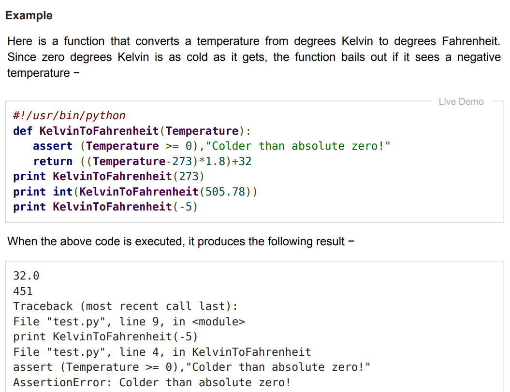
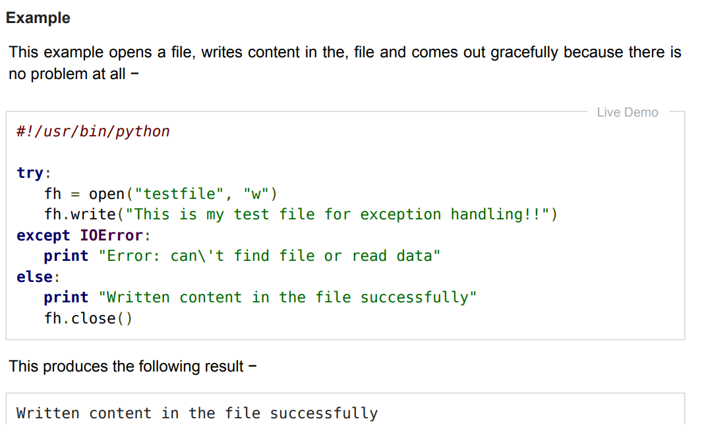
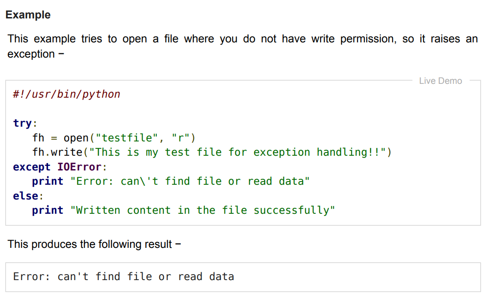
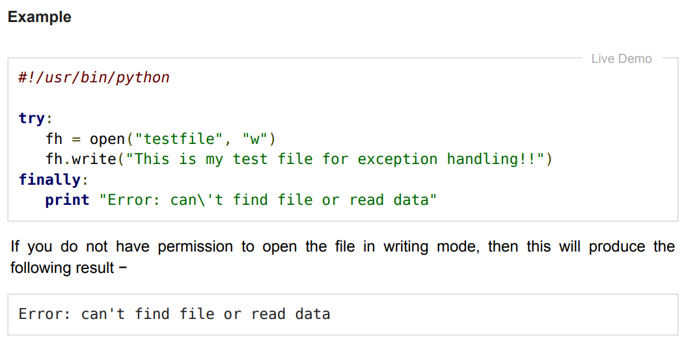
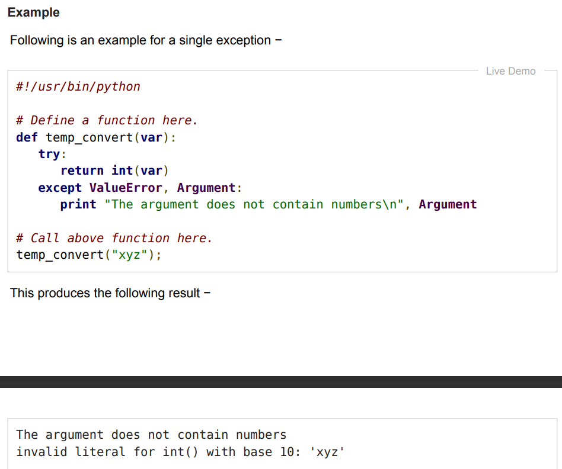
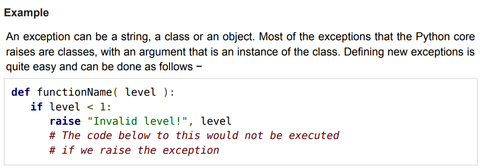

# praktikum8
## Nama : Muhammad Din Al Ayubi
## NIM : 312210293
## Kelas : TI.22.A3
## Penjelasan Ke 1

+ Berikut adalah fungsi yang mengubah mengubah suhu suhu dari derajat Kelvin ke derajat Fahrenheit. Karena nol derajat Kelvin sedingin yang didapat. Ketika kode di atas dijalankan, muncul Exception yang bernama Traceback...AssertionError artinya terjadi error pada pernyataan assert.
## Penjelasan Ke 2

+ contoh ini membuka file, menulis konten di file, dan keluar tidak ada masalah, Ini menghasilkan hasil berikut
+ Written content in the file successfully
+ Dan kenapa hasilnya begitu? karena else akan dijalankan ketika try adalah True
## Penjelasan Ke 3

+ Mengapa muncul error?
+ ```Error: can't find file or read data```
+ r adalah read - Membuka file untuk membaca, error jika file tidak ada. Disini ingin membaca file bukan menulis maka dibawahnya ```fh = open("testfile", "r")``` ```tambahkan print(fh.readline()) dan fh.write dihapus```. Setelah dijalankan, try dan else ditampilkan
## Penjelasan Ke 4

+ Menghasilkan output:
```Error: can't find file or read data```
+ Ini bukan error, karena finally dijalankan ketika try dan except dijalankan. Dan berhasil dibuat filenya setelah dijalankan
## Penjelasan Ke 5

+ ketika dijalankan, maka muncul error. Hapus #!/usr/bin/python dan di except ValueError, Argument: ganti koma dengan as seperti except ValueError as Argument:agar tidak error. Jika dijalankan akan muncul error lagi
+ The argument does not contain numbers invalid literal for int() with base 10: ```xyz```
+ kenapa? karena parameter def temp_convert harus mengandung angka
## Penjelasan Ke 6

+ Jika dijalankan muncul SyntaxError artinya ada kesalahan sintaks. Pada raise ```Invalid level!```, level ganti tanda koma dengan tanda plus. Cetak def dengan angka yang lebih besar dari 1